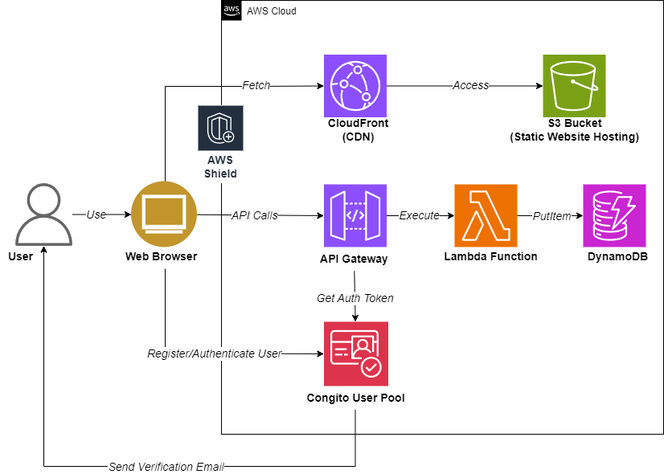

# login-page

A toy project enables user registration, login, logout, password reset, and contact form submission functionalities.

[Click HERE](https://login.leohong.dev/) to view the latest deployed version of the application.

## Architecture

## Tech Stack

The application is built on a modern tech stack, combining AWS services with standard web technologies:

- **AWS Services**: S3, ACM, CloudFront, Cognito, API Gateway, Lambda, DynamoDB
- **Web Technologies**: HTTP, CSS, JavaScript, NodeJS

## Security

- CloudFront Security Headers
- Data encrypted in transit (HTTPS) and at rest (by AWS)
- User authentication using Cognito
- CORS and Cognito user pool as Lambda authorizer for API Gateway
